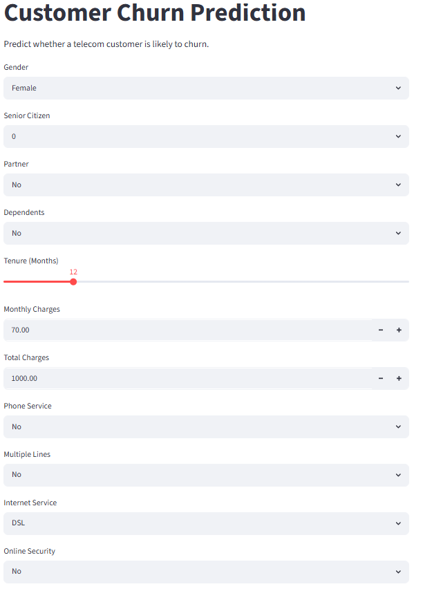
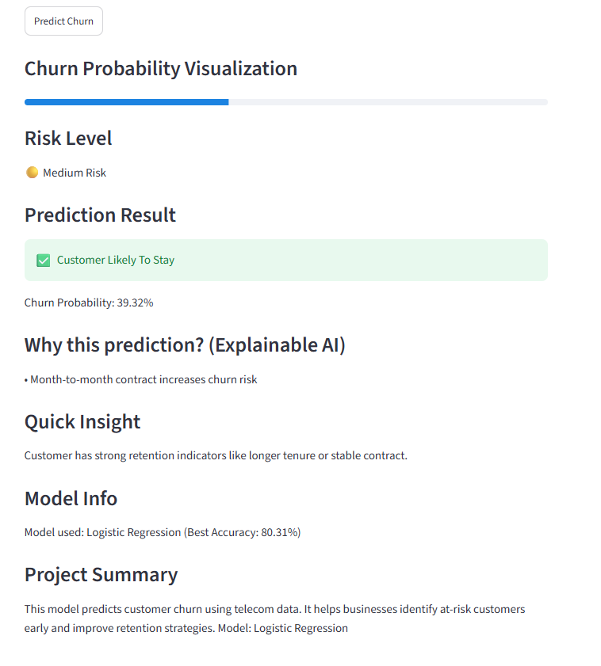
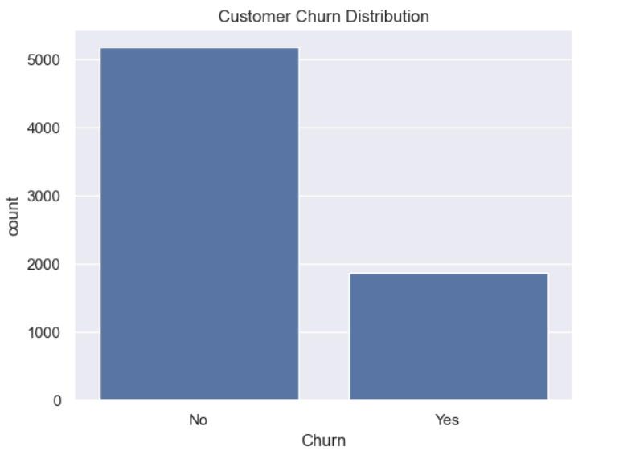
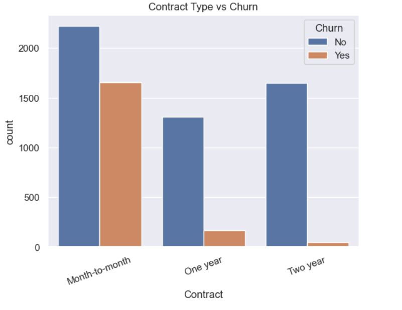

# 📊 Customer Churn Prediction System

## 🌐 Live Demo
🚀 Streamlit App:
https://customer-churn-prediction-9f7fregswscfyyuumt6nk4.streamlit.app/

---

## 🧠 Overview
This project predicts whether a telecom customer is likely to churn based on demographic, account, and service usage data.  
It provides an interactive web application built using Streamlit for real-time prediction and explainable AI insights.

## 🎯 Objective
To build a machine learning model that identifies customers at risk of leaving (churn) so that telecom companies can take proactive retention actions and improve customer satisfaction.

## 📂 Dataset
Telco Customer Churn Dataset containing:
- Customer demographics  
- Subscription details  
- Service usage patterns  
- Billing information  

## ⚙️ Tech Stack
Python, Pandas, NumPy, Scikit-learn, Streamlit, Matplotlib, SHAP

## 🤖 Machine Learning Model
- Algorithm: Logistic Regression  
- Accuracy: ~80.31%  
- Problem Type: Binary Classification (Churn / No Churn)  

## 📊 Model Performance
- Accuracy: 80.31%  
- Evaluation: Train-Test Split  

## 🧹 Data Processing
- One-Hot Encoding for categorical variables  
- Feature alignment using saved training columns  
- Model saved using Joblib  

## 🚀 Features of the App
- Interactive user input interface  
- Real-time churn prediction  
- Risk classification:
  - 🟢 Low Risk  
  - 🟡 Medium Risk  
  - 🔴 High Risk  
- Explainable AI insights using SHAP  

## 📷 UI Screenshots
Place screenshots inside `reports/` folder:

- Input UI  
  

- Prediction Result  
  

- Churn Distribution  
  

- Contract vs Churn  
  

## 🧪 How to Run

pip install -r requirements.txt  
streamlit run app/app.py

## 👨‍💻 Author
THIPPANABOINA NAGATEJA
